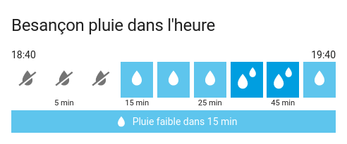
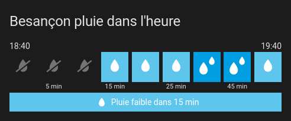

# home-assistant-meteo-france-next-rain-card
A simple card to show next hour rain forecase from [Météo France weather integration](https://www.home-assistant.io/integrations/meteo_france/)

The UI is very similar to what is shown on Météo France website: 1 slot for every 5 minutes slot.

# Preview

# Installation:
Follow only one of these installation methods.

  
<b>Installation and tracking with HACS:</b>

1. Go to HACS panel
2. Click on "Interface"
3. Click on the menu at the top and choose "Custom Repository" in the menu
4. Enter "https://github.com/nyroDev/home-assistant-meteo-france-next-rain-card" for repository field
5. Choose "Lovelace" for category field
6. Click "Add"
7. Close the "Custom Repository" window
8. Click on "Météo France Next Rain Card repository"
9. Click on "Download" button at bottom
10. Set the lovelace panel

  
<b>Manual installation:</b>

1. Copy meteo-france-next-rain-card into your 'www' folder in the hass config directory. The *'www'* folder can be accesed via *'/local/'* in your configuration I've put my custom elements in the sub folder *'elements'* and the js file of this card in the folder *'meteo-france-next-rain-card'* as an example.
2. Enable advanced mode and in your lovelace dashboard settings
3. Add a resource 

   or if you use yaml to configure lovelace:

		resources:
			- type: module
	        	  url: /hacsfiles/elements/meteo-france-next-rain-card/meteo-france-next-rain-card.js
4. Set the lovelace panel

# Set lovelace panel

Add the following lines to a view in '*cards:*' as a *'manual card'* or use your yaml configuration and add:

    type: 'custom:meteo-france-next-rain'
    entity: sensor.CITY_next_rain

## Options
|option| default|description|
|--|--|--|
|  entity| sensor.CITY_next_rain| The configured Météo France Next Rain Sensor. It will default to the first found. |
|  name| ''| Replace the title card with this option
